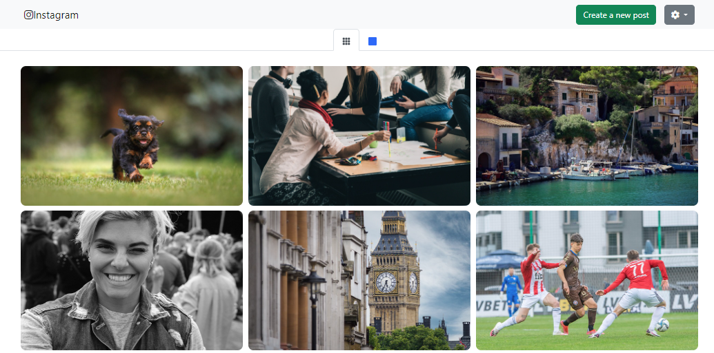
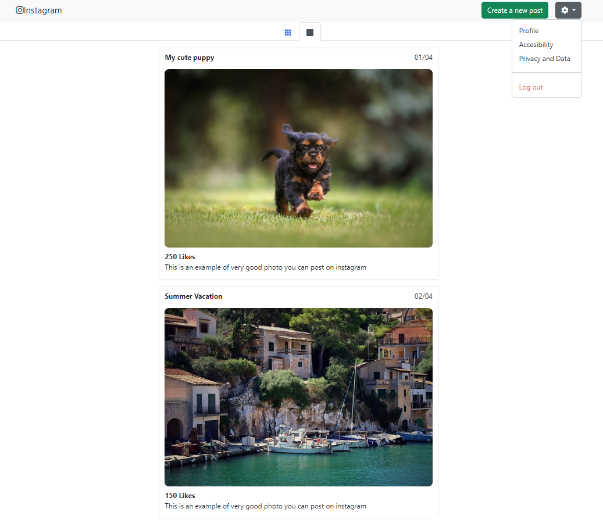

# Instagram Feed con Bootstrap

Este proyecto es una implementación de una interfaz de Instagram utilizando Bootstrap para la maquetación y diseño, así como Font Awesome para iconos. Incluye características como un menú de navegación, un modal para crear una nueva publicación, un menú desplegable de configuración y dos formas de visualizar las imágenes: en cuadrícula y en lista.

### Vista Cuadrícula

### Vista Vertical

## Tecnologías Utilizadas

- **HTML5**
- **CSS3**
- **Bootstrap 5**
- **Font Awesome**

## Estructura del Proyecto

El proyecto consta de un archivo HTML (`index.html`), un archivo CSS (`styles.css`), y una carpeta de imágenes (`/imagenes`). 

## Características

- **Barra de Navegación**: Incluye el nombre "Instagram", un botón para crear una nueva publicación y un menú desplegable de configuración con opciones como "Profile", "Accessibility", "Privacy and Data" y "Log out".
  
- **Modal para Crear una Nueva Publicación**: Al hacer clic en el botón "Create a new post", se abre un modal donde se puede agregar una descripción. Los botones para subir imágenes y añadir una ubicación están actualmente deshabilitados.

- **Cambio de Vista**: Hay dos botones para cambiar la vista de las imágenes: una vista en cuadrícula y una vista en lista. 

- **Galería de Imágenes**: La galería de imágenes se muestra en una cuadrícula o en una lista con detalles como título, fecha y número de "Likes".

## Cómo Ejecutar el Proyecto

1. Clona o descarga este repositorio en tu máquina local.
2. Asegúrate de tener una estructura de carpetas que coincida con la anterior, especialmente la carpeta `imagenes` con las imágenes correspondientes.
3. Abre el archivo `index.html` en tu navegador.

## Estilos Personalizados

El archivo `styles.css` incluye algunos estilos personalizados para mejorar la apariencia de la interfaz:

- **Centrado y Alineación**: Los elementos se centran y alinean utilizando flexbox.
- **Estilos para Imágenes**: Las imágenes tienen un tamaño específico, bordes redondeados y un efecto de borde al pasar el ratón.
- **Espaciado**: Se ajusta el espaciado y la alineación de los elementos de la galería.

## Recursos Externos

- **Bootstrap**: Se utiliza Bootstrap 5 para la maquetación y el diseño responsive. Los enlaces a las hojas de estilo y los scripts de Bootstrap se incluyen en el archivo HTML.
- **Font Awesome**: Se utiliza para mostrar iconos en la barra de navegación y el modal.

## Mejoras Posibles

- Habilitar los botones en el modal para permitir subir imágenes y añadir una ubicación.
- Añadir funcionalidad real a los elementos como "Log out" y "Profile".
- Mejorar la experiencia del usuario al cambiar entre las vistas de cuadrícula y lista.
- Añadir más funcionalidades similares a Instagram, como comentarios y compartición de publicaciones.

## Licencia

Este proyecto es solo un ejemplo educativo y no está destinado para uso comercial.

